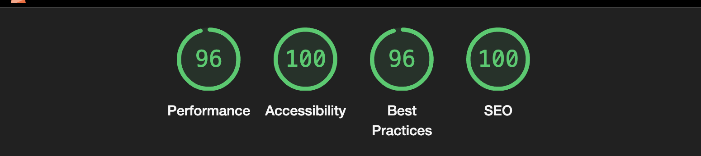

## Dev.to Frontend Challenge June

This project it will be used for the dev.to frontend challenge. I choose the second challenge: the beaches.

## How it works?

I'm using the Vanilla Javascript and the mock API to provide the images and the lat/long. And with the coordinates I'm using Leaflet to display the map location of the beach.

I'm not using NPM/Yarn/PNPM as dependency package manager. This project is a simple project using vanilla javascript and using all the functions to replace and manipulate the DOM, just using javascript.

All styles is a simple file of CSS.

For the fonts I'm using the Google Fonts.

Also, is responsive, with accessibility, performance and Best SEO!

## How to run?

Just use the Live Server of VS Code extension. Click on HTML file with the right button of the mouse and click on `Open Live Server`. Access the `http://localhost:5501/index.html`.

This project is hosted on Vercel. Just access the `https://devto-frontend-challenge-june.vercel.app/`

## Light House Metrics

